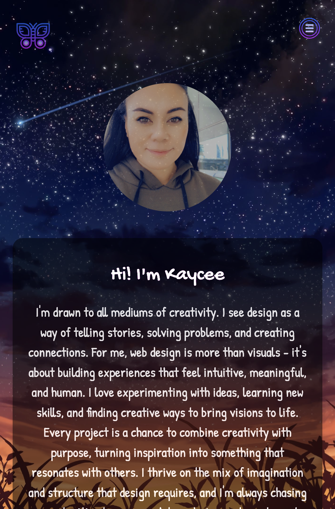

#  Thisiskaysis - Portfolio Task
​
# [My portfolio site](https://thisiskaysis.github.io)
​
## Project Requirements

### Content
 Add a short paragraph describing the features below. What aesthetic and technical choices did you make? 
- [x] At least one profile picture
- [x] Biography (at least 100 words)
- [x] Contact Form
- [x] "Projects" section
- [x] Links to external sites, e.g. GitHub and LinkedIn.

---

I wanted to create a website that felt more creative and showed my personality a little. The background image combines my loves of anime, the night sky, and feels a little ethereal. The girl sitting on the right feels like me - looking up to the stars, dreaming about possibilities, manifesting ideas. I knew I wanted to use purples, greens, blues being my favourite colours - and once I decided on background image I wanted to make each section blend using opacity. I noticed that it may make the text harder to read, so I added hover effects (contrast) to help with readability.

The icon choices also needed to fit the theme - I chose to add links to Github, LinkedIn, Facebook and Instagram *(although I will probably delete the social media at a later stage - I just wanted more than 2 for aesthetics!)*.

The projects section is currently blank, but I will have content to put here soon!

I struggled mostly with condensing my ideas into something cohesive, creating a website that is easy and pretty to use, but not over-the-top.  
(*As the saying goes... Too many sprinkles, not enough donuts...*)
​
### Technical
 Add a short paragraph describing the features below. What strategies or design decisions did you work from? 
- [x] At least 2 web pages.
- [x] Version controlled with Git
- [x] Deployed on GitHub pages.
- [x] Implements responsive design principles.
- [x] Uses semantic HTML.

---

I chose to create 4 pages - index, about, projects, contact.

I used the template of my_first_website as a basis to work from, changing and adapting it as I learnt new skills each week. I controlled all versions with Git, committing changes frequently and working on branches for any new details or ideas, then merging to main.

With **responsiveness**, I first started with positioning my articles stacked in a column for smaller, phone-sized screens (below 768px). I then added media queries to expand to a row, 3 wide, for larger screens (above 768px).

I noticed there was a *weird area* in the middle of these sizes, where the articles started to condense and look far too skinny below 1040px. So I made a third media query, to target width between 768px and 1040px, which sets the first 2 articles in a row, and the third article beneath them spanning the entire width of both articles above it.

I added contrast(200%) on phone & tablet screens for readability since hover effects won't work.

I tried to use **semantic HTML** through the entire code, however I had to use < div > once in order to get my hero text animation working - I tried to use < ul > and < li > but couldn't get the animation to function *(troubleshooting that... fun times)*.

### Bonus (optional)
 Add a short paragraph describing the features below, if you included any. 
- [x] Different styles for active, hover and focus states.
- [ ] Include JavaScript to add some dynamic elements to your site. (Extra tricky!)

---

I **loveeeee** hover effects! I used many hover effects through my website:
- **On articles:** contrast 150% for better readability.
- **On buttons:** transform scale and translateY + box-shadow to add raise effect, as well as colour change.
- **On < nav > menu:** colour change, pointer change.
- **On social media icons:** transform scale.
​ 

I got some **animation** happening on my hero text!  
Troubleshooting that may have melted my brain a little (*will I ever recover?*) .. I spent a lot of time on codepen.io trying to understand ***what on earth is even happening here*** and trialling different pieces of code until I achieved the output I wanted.  
Keyframes (*Oh boy, don't get me started*) were a big learning curve, it was difficult to get the animation really smooth without several painstaking hours of staring into oblivion. Thankfully, from the abyss, Jesus took the wheel and we got the job done. (*yippee*)

I ***tried*** some javascript, some very bad javascript. I dove in head first with no previous knowledge or understanding of the cataclysm that is javascript. Quite like the overweight cat I owned as a kid, it just didn't work out.  
*who even wrote that language...?*

# Screenshots

## **Homepage (index.html)**

### Index 1 - Full View

### Index 2 - Full View

### Index - Tablet View

### Index - Phone View

## **About Page**

### About Me - Full View

### About Me - Tablet View

### About Me - Phone View

## **Projects Page**

### Projects - Full View

### Projects - Tablet View

### Projects - Mobile View

## **Contact Page**

### Contact - Full View

### Contact - Tablet View

### Contact - Mobile View

 

# **Now for the fun part - Cool Effects!**

## **Hovers**

### Article Hover

### Button Hover

### Nav Hover

### Socials Hover

## **Awesome amazing text animation that melted my brain**

### *I'd promise it wasn't that bad but I'd be lying*
